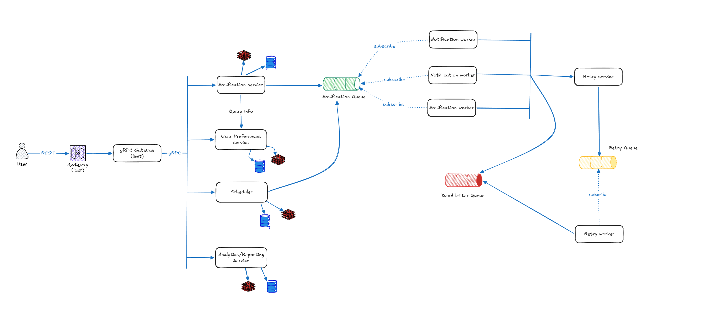

**Language:** English | [Tiếng Việt](README.vi.md)

# go-notification-system

An **enterprise-style** notification system supporting multiple channels (Email/SMS/Push/In-app), prioritizing **scalability**, **high availability**, and **low latency**. This repository is currently in the **architecture + scaffolding** phase for a microservices-based design.



## Goals

- Handle large notification volume (spiky peak loads during campaigns/incidents).
- Decouple producers/consumers via message queues for horizontal scaling.
- Provide a clear retry policy and a **Dead Letter Queue (DLQ)** for permanent failures.
- Track delivery status and analytics for operational insight.

## High-level architecture (based on the diagram in `docs/`)

### Core services

- **API Gateway (REST)**: client entrypoint; auth/rate limiting/routing.
- **gRPC Gateway / Reverse Proxy**: bridges REST → gRPC and routes to backend services.
- **Notification Service**: orchestration core (formatting, template/user prefs, enqueue jobs).
- **User Preferences Service**: per-user/per-tenant settings (channels, quiet hours, opt-in/out).
- **Scheduler**: scheduled/recurring notifications; enqueues at the correct time.
- **Analytics/Reporting Service**: collects events (sent/delivered/opened/clicked) and metrics.

### Queue + Worker + Retry

- **Notification Queue**: holds send jobs.
- **Notification Workers**: consume jobs and deliver via providers (SMTP/SMS gateway/FCM...).
- **Retry Service + Retry Queue**: applies retry strategies (e.g., exponential backoff).
- **Dead Letter Queue (DLQ)**: stores jobs that exceeded retry limits for investigation.

### Storage/Cache (direction)

- **DB (SQL)**: notification metadata/status, user preferences, schedules.
- **Cache (Redis)**: cache preferences/templates/recent statuses to reduce DB load.

## Functional requirements (summary)

- Multi-channel notifications: Email/SMS/Push/In-app.
- User preferences: channels, frequency, quiet hours; per user/tenant.
- Scheduling & prioritization: schedule delivery; prioritize by importance.
- Template management: dynamic templates with placeholders + versioning.
- Multi-tenancy: isolate data/config per tenant.
- Batch sending: bulk campaigns.
- Retry mechanism: configurable policy + DLQ.
- Analytics/reporting: delivery + engagement metrics.

## Non-functional requirements (summary)

- Scalability: horizontal scaling (services/workers).
- High availability: avoid single points of failure.
- Low latency: fast handling for high-priority messages.
- Fault tolerance: resilient to provider/network failures.
- Security & compliance: in-transit/at-rest encryption, audit logging, GDPR direction.
- Rate limiting: per user/tenant/global.

## Capacity planning (assumption-based)

The numbers referenced in the analysis are **assumptions** for capacity planning (e.g., 200M/day, peak 10M/min). In production, calibrate them against real traffic and SLA.

## Repository structure

The codebase separates **entrypoints** (`cmd/`), **core domain** (`internal/`), and **shared packages** (`pkg/`).

```
.
├── cmd/
│   ├── proxy/                 # Reverse proxy (grpc-gateway) - REST → gRPC entrypoint
│   │   ├── config/            # Proxy config loader
│   │   ├── config.yml         # Example config
│   │   └── main.go            # HTTP server + grpc-gateway mux
│   ├── notification/          # Notification service entrypoint (skeleton)
│   └── user/                  # User Preferences service entrypoint (skeleton)
│
├── internal/
│   └── notification/          # Notification bounded context (skeleton)
│       ├── app/               # App bootstrap / wiring
│       ├── domain/            # Entities/VOs/domain services
│       ├── usecases/          # Application use-cases
│       └── infras/            # DB/queue/provider integrations
│           ├── postgresql/     # PostgreSQL + sqlc generated queries
│           │   ├── query/      # sqlc input queries (*.sql)
│           │   └── gen/        # sqlc generated Go code
│           └── repo/           # Repository implementations (inmem/postgres, ...)
│
├── pkg/
│   ├── config/                # Shared config structs
│   ├── logger/                # Logging adapters (logrus ↔ slog)
│   ├── postgres/              # PostgreSQL helpers (direction)
│   ├── rabbitmq/              # RabbitMQ helpers (direction)
│   └── utils/                 # Shared utilities
│
├── proto/
│   └── gen/                   # Proto and/or generated code location (placeholder)
│
├── db/
│   └── migrations/            # Goose migrations (PostgreSQL)
├── docker/                    # Dockerfiles
├── docs/                      # Documents & diagrams
├── rests/                     # HTTP client files for dev
├── third_party/               # OpenAPI and external assets
├── tools/                     # Tooling (protoc generators, sqlc, ...)
├── go.mod
└── go.sum
```

## DDD / bounded-context layout

This repo follows a pragmatic DDD-style layout per bounded context (currently: **notification**).

- **`internal/<context>/domain`**: entities/value objects and *ports* (interfaces) that the domain/use-cases depend on.
- **`internal/<context>/usecases`**: application services (orchestrate domain + ports).
- **`internal/<context>/infras`**: adapters (Postgres/sqlc, queues, external providers).
- **`internal/<context>/app`**: composition root (Wire injector, router/server bootstrap).

The key idea is: domain/usecases do **not** import infrastructure packages; only infrastructure implements domain ports.

## Local run (implemented parts)

Some services are still in-progress, but the **notification** context already has working building blocks:

- PostgreSQL connection via `pkg/postgres`
- Goose migrations under `db/migrations`
- `sqlc` codegen under `internal/notification/infras/postgresql/gen`
- Postgres-backed repository implementation under `internal/notification/infras/repo`

### Start dependencies

- Start PostgreSQL: `docker compose -f docker-compose-core.yml up -d postgres`

### Run migrations (notification DB)

This repo provides a per-context Makefile that can derive `GOOSE_DBSTRING` from `cmd/notification/config.yml` (without requiring `yq`).

- Apply migrations: `make -f cmd/cli/makefile/notification/main.mk upGoose`
- Reset DB (dev only): `make -f cmd/cli/makefile/notification/main.mk resetGoose`

### Generate sqlc code

- `sqlc generate`

### Run services

- Notification service: `go run ./cmd/notification`
- Proxy (grpc-gateway): `go run ./cmd/proxy`

## OpenAPI / Swagger

This repo generates OpenAPI v2 (Swagger) from protobuf annotations using `buf`.

- Generate gRPC + grpc-gateway + OpenAPI artifacts: `make protogen`
- Open Swagger UI (when proxy is running): `http://<proxy_host>:<proxy_port>/swagger/`
	- The proxy serves the OpenAPI JSON at `/swagger/doc.json` (from `third_party/OpenAPI/notification.swagger.json`).

## Notes

- Architecture diagram: `docs/Architechture-design.png`.
- `cmd/notification` and `internal/notification/*` are under active development; expect API/contracts to change.
